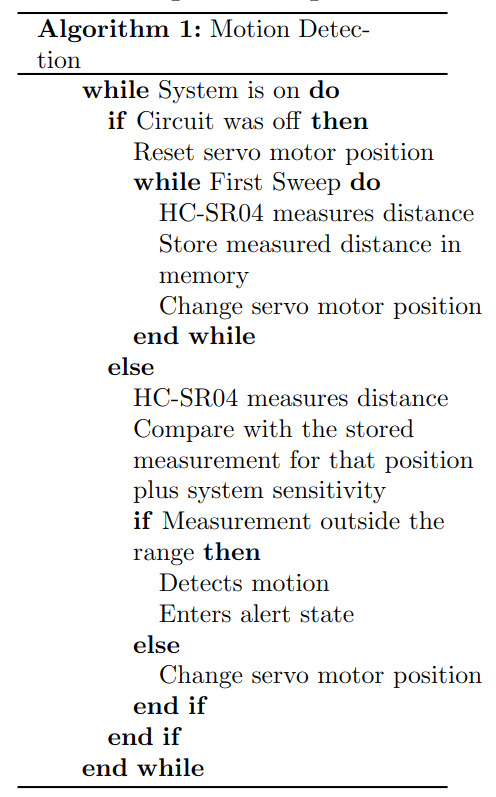

# Security System

This repository contains the ***Security System*** project developed in the Digital Laboratory II course. The project was developed in three 3 sprints, detailed below.

## Week 1: Basic Journey

The objective of Week 1 of the project is to implement the basic functionalities of the project, meeting the functional requirements of the user's Basic Journey.

### Functional Requirements

The proposed system ***in security mode*** must identify if there has been any movement inside a room and enter ***alert mode*** if detection occurs. In alert mode, an alert message is sent using ***UART*** in the format:

> ALERT time angle,distance

Where ***time***, ***angle***, and ***distance*** represent the time of detection, the position of the servo motor where movement was detected, and the distance measured by the ultrasonic sensor at that position, respectively.

In alert mode, a ***buzzer*** is activated. The alert can also be viewed on the client's mobile phone through the ***MQTT Dash*** application.

### Non-Functional Requirements

To detect movement, the system must also consider ***measurement imprecision*** and ***environmental conditions*** to generate sensor sensitivity.

Thus, for a given measurement, a sensitivity range is defined where the variation is not considered sufficient to trigger the alert.

### Physical Requirements

Initially, the components of the ***Home Lab Kit*** are necessary, which will interact with the physical infrastructure of the ***Lab EAD*** of the Digital Laboratory II course. Since the sonar will be reused for the group's project, the ***SG90 servo motor*** and the ***HC-SR04 sensor*** are needed, in addition to the ***Wemos D1 R1 board*** which has the ***ESP8266*** component.

The password functionality was implemented using Arduino, so it is exclusive to the Home Kit. To enable demonstrations in the LabEAD infrastructure, it is possible to deactivate the password functionality with an input signal. In this test mode, interaction with Arduino is not necessary. The Processing Dashboard and the Google Colab Notebook operate in this test mode.

To mediate communication with the laboratory's FPGA, it is also possible to use the ***MQTT Dash*** application.

### Implementation

#### Persistence of event data

The Processing Dashboard stores all session data in a txt file.
